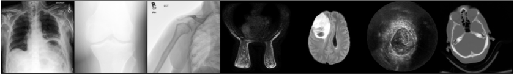
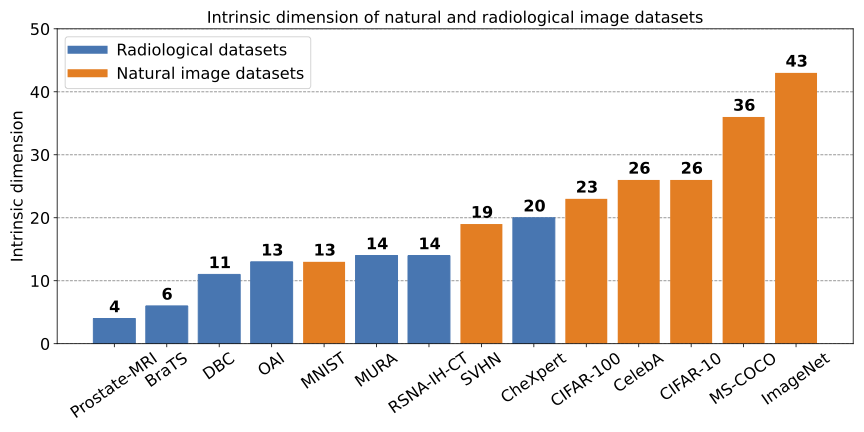
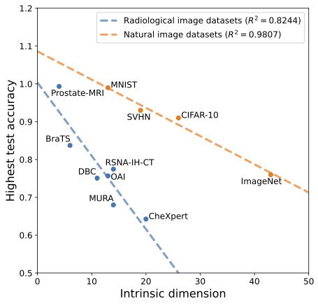

# Intrinsic Dimensions of Medical Images
#### By [Nicholas Konz](https://nickk124.github.io/), Hanxue Gu, Haoyu Dong and [Maciej Mazurowski](https://sites.duke.edu/mazurowski/).

[](https://arxiv.org/abs/2207.02797)

This is the official repository for our MICCAI 2022 paper [*The Intrinsic Manifolds of Radiological Images and their Role in Deep Learning*](https://arxiv.org/abs/2207.02797), where we analyze the intrinsic dimension of medical image datasets, and show how this affects the generalization ability of a neural net trained on the data.



## Code Usage/ Reproducing the Results
You can use our code to:
1. Compute the intrinsic dimension (ID) of medical image datasets (Paper Section 4.1) and
2. Evaluate neural network generalization ability vs. dataset intrinsic Dimension (Paper Section 4.2).

Please follow the steps outlined in `reproducibility_tutorial.md` in order to reproduce the results of the paper.


## Citation
Please cite our paper if you use the code or reference our work:
```bib
@inproceedings{konz2022intrinsic,
  title={The Intrinsic Manifolds of Radiological Images and Their Role in Deep Learning},
  author={Konz, Nicholas and Gu, Hanxue and Dong, Haoyu and Mazurowski, Maciej},
  booktitle={International Conference on Medical Image Computing and Computer-Assisted Intervention},
  pages={684--694},
  year={2022},
  organization={Springer}
}
```

## Paper Abstract
The manifold hypothesis is a core mechanism behind the success of deep learning, so understanding the intrinsic manifold structure of image data is central to studying how neural networks learn from the data. Intrinsic dataset manifolds and their relationship to learning difficulty have recently begun to be studied for the common domain of natural images, but little such research has been attempted for radiological images. We address this here. First, we compare the intrinsic manifold dimensionality of radiological and natural images. We also investigate the relationship between intrinsic dimensionality and generalization ability over a wide range of datasets. Our analysis shows that natural image datasets generally have a higher number of intrinsic dimensions than radiological images. However, the relationship between generalization ability and intrinsic dimensionality is much stronger for medical images, which could be explained as radiological images having intrinsic features that are more difficult to learn. These results give a more principled underpinning for the intuition that radiological images can be more challenging to apply deep learning to than natural image datasets common to machine learning research.  We believe rather than directly applying models developed for natural images to the radiological imaging domain, more care should be taken to developing architectures and algorithms that are more tailored to the specific characteristics of this domain. The research shown in our paper, demonstrating these characteristics and the differences from natural images, is an important first step in this direction.

See the paper here:
- arXiv preprint version (open access): https://arxiv.org/abs/2207.02797
- published version: https://link.springer.com/chapter/10.1007/978-3-031-16452-1_65

Related resources:
- [MICCAI 2022 poster](https://github.com/nickk124/MICCAI22_poster/blob/52c75fb93369b5c43f4aedfd5e73131a082e1657/poster.pdf)
- My related talk from The Pacific Northwest Seminar on Topology, Algebra, and Geometry in Data Science (TAG-DS): [slides here](https://nickk124.github.io/files/intrinsic_manifolds_TAG-DS_talk.pdf)

## Main Findings

1. Natural image datasets generally have higher intrinsic dimension than radiology datasets:

3. The relationship of test prediction accuracy and dataset intrinsic dimension is linear *within* both of these two domains, but,
4. The *steepness* of this relationship greatly differs between natural and radiological domains:


A future endeavor is to determine the theoretical reasons for all of these findings.
